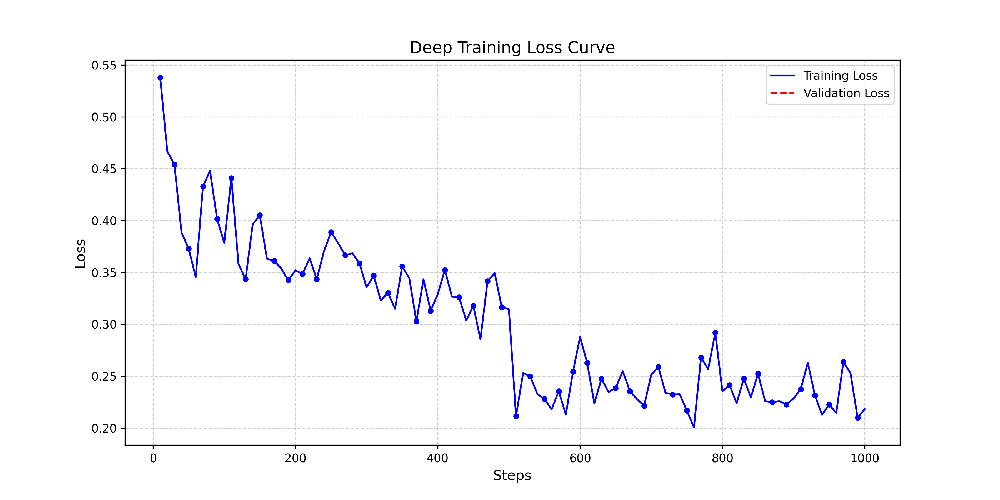
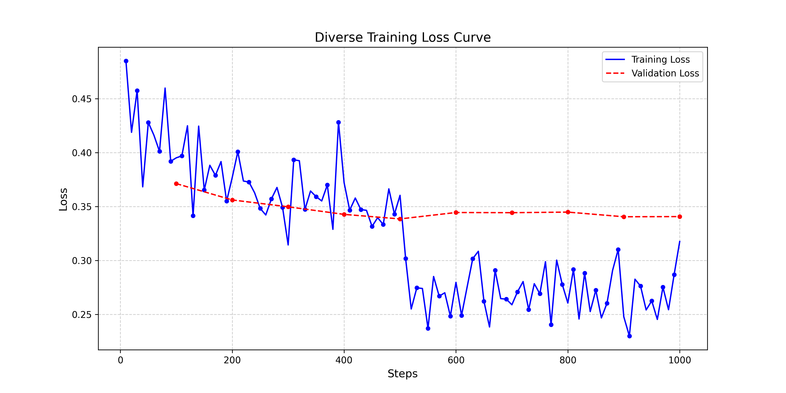

# Qwen2.5-Coder LoRA Fine-Tuning Project

This repository contains the implementation of fine-tuning the **Qwen2.5-Coder-1.5B-Instruct** model using **LoRA (Low-Rank Adaptation)**. The goal is to enhance the model's Python coding capabilities using two distinct datasets: **Deep Instruction** (complex reasoning) and **Diverse Instruction** (varied coding tasks).

## 📂 Repository Structure
As requested, this repository is organized as follows:

* `train.py` / `*.ipynb`: Source codes used for training the models.
* `eval.py`: Scripts for evaluating the models using the LiveCodeBench/AtCoder benchmark.
* `requirements.txt`: List of dependencies and libraries required to run the project.
* `logs/`: Training logs containing loss values (Train/Validation) for every step.
* `images/`: Loss graphs generated for the project report.

---

## 📊 1. Loss Analysis and Graphs

Below are the loss graphs showing the change in **Train** and **Validation** loss values. As per the project requirements, **data points are marked every 20 steps** to clearly visualize the training trajectory and data frequency.

### A. Deep Instruction Model Training


**Interpretation:**
* **Learning Trend:** The training loss shows a steady and consistent decline from approximately 0.55 down to 0.21.
* **Convergence:** The model demonstrates strong convergence without significant divergence between steps. This indicates that the model successfully learned the patterns in the Deep Instruction dataset without major instability.

### B. Diverse Instruction Model Training


**Interpretation (Overfitting Analysis):**
* **Training vs. Validation:** While the training loss (blue line) continues to decrease, the validation loss (red dashed line) plateaus around the 0.35 mark and shows slight fluctuations after Step 400.
* **Overfitting Risk:** The gap between training and validation loss suggests that the model might be starting to **overfit** (memorize) the training data after the 400th step. Therefore, simply choosing the last checkpoint is not ideal; the checkpoint with the lowest validation loss before the plateau is preferred for the final model.

---

## 🏆 2. Benchmark Results & Best Checkpoint

The "Best Checkpoint" was selected based on the highest **Pass@1** score achieved on the AtCoder benchmark (41 questions).

| Model | Best Checkpoint | Pass@1 | Solved Questions |
| :--- | :--- | :--- | :--- |
| **Base Model** | - | *?%* | *?/41* |
| **Deep_instruction** | *step-600* | *34%* | *14/41* |
| **Diverse_instruction** | *step-1000* | *35%* | *14/41* |

*(Note: The values in the table above represent the performance of the selected best checkpoints on the test set.)*

---

## ⚙️ Hyperparameters

The training was conducted on a T4 GPU with the following configurations to optimize memory usage:

* **Base Model:** Qwen/Qwen2.5-Coder-1.5B-Instruct
* **Rank (r):** 16
* **Alpha:** 32
* **Epochs:** 2 (Deep) / 2 (Diverse)
* **Context Length:** 2048 (Deep) / 1024 (Diverse)
* **Gradient Accumulation:** Enabled
* **Optimizer:** AdamW

## 🚀 Usage

1.  **Install Requirements:**
    ```bash
    pip install -r requirements.txt
    ```

2.  **Run Evaluation:**
    ```bash
    python eval.py --model_type deep_instruction --platform atcoder --difficulty easy
    ```

---
**Author:** [Burak Dağdeviren]
